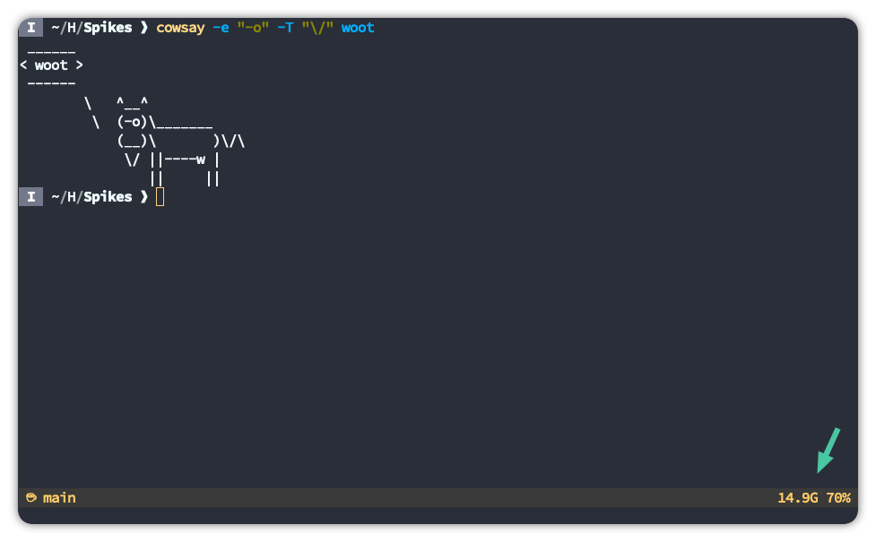

# woot-bar

<h1 align="center">
  
</h1>

<h4 align="center">Ultra minimalist status bar that displays used memory and CPU usage</h4>

`woot-bar` is made for `tmux` but it is compatible with anything that eats `stdout` really.

Example output:

```sh
9.9G 28%
```

## Installation

```sh
curl -sL https://raw.githubusercontent.com/ngryman/woot-bar/main/install.sh | sh -
```

The script will download `woot-bar` to `/usr/local/bin` and optionally configure `tmux` for you
automatically.

## Configuration

If you prefer to configure `tmux` manually, here's what you need to add to your configuration:

```
# `woot-bar` updates every 4 seconds
set -g status-interval 4

# Display stats on the right side
set -g status-right "#(/usr/local/bin/woot-bar) "
```
